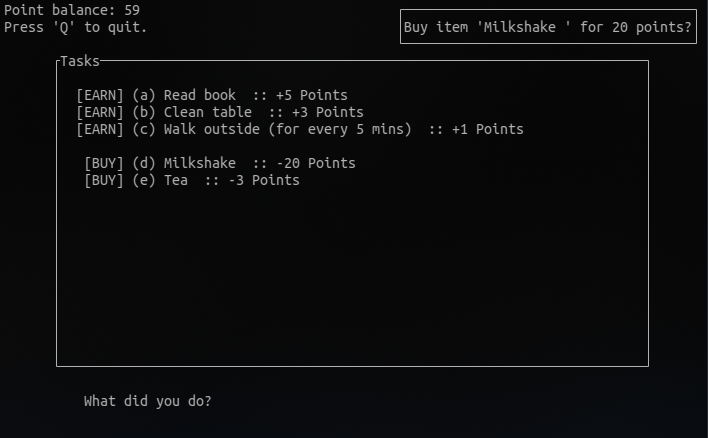

# Point System
Point System is an ncurses-based application that keeps track of the various tasks one does.

## Showcase

## Why?
To make sure I do work (it feels like I earned something for what I do, I'm a teenager)

## Todo
- Add a 'history' area that lists past actions
- Add the ability to add/remove items from [EARN] and [BUY]
- Checks to make sure that value of keys in .ini file is numeric
- Ability to specify which items.txt and score.txt file to use
- Correct alignment of colons (::)
- Ability to scroll through the options instead of pressing a key (and ability to scroll past visible area to reach unseen options)
- Themes!
